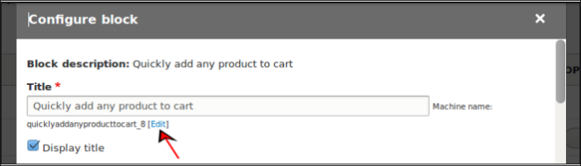
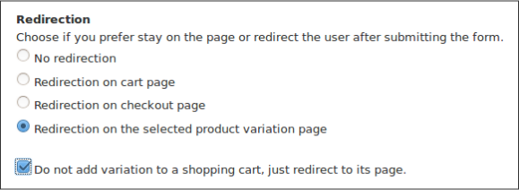
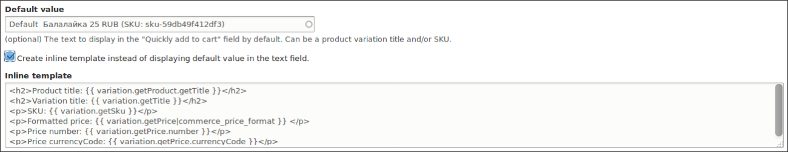
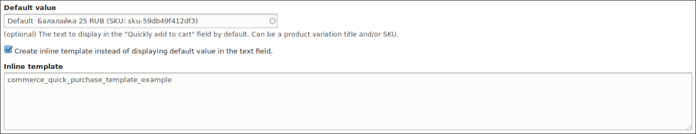
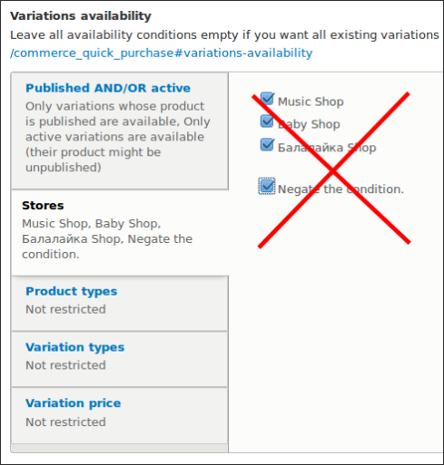
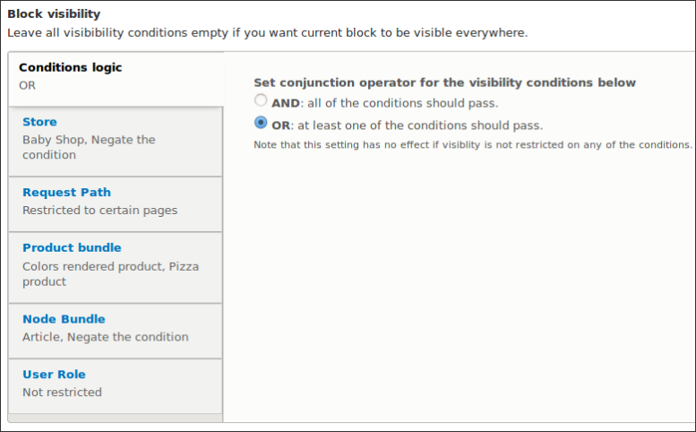
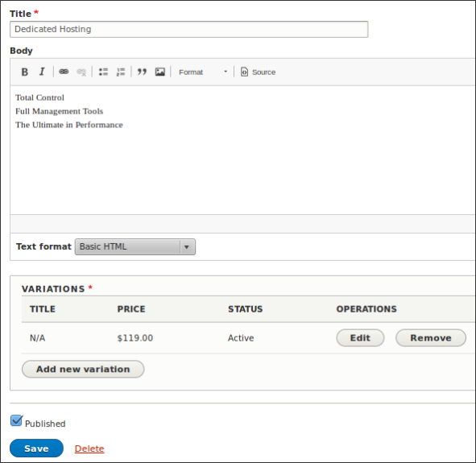
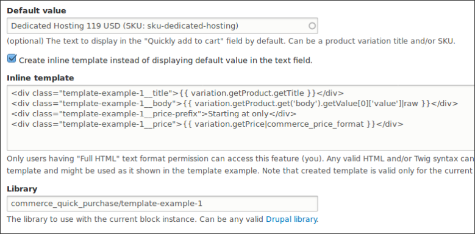
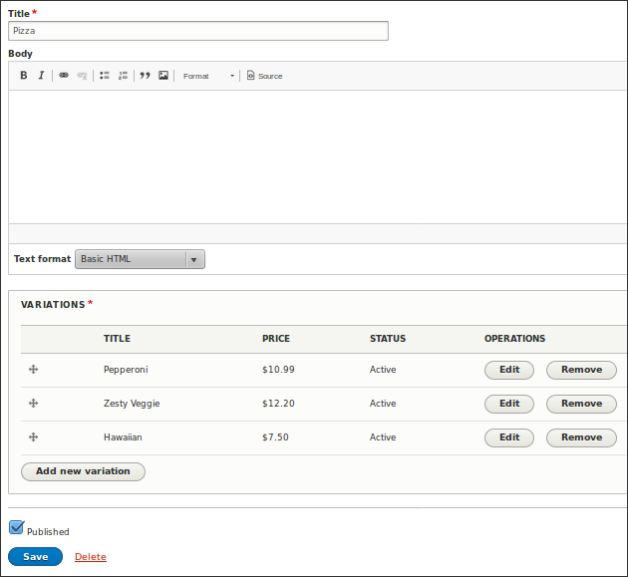
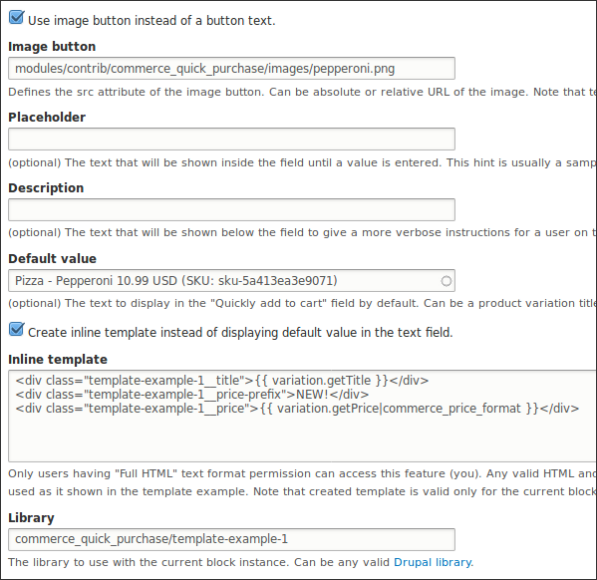

Commerce Quick Purchase
=======================

Provides a block with a textfield and a button allowing quickly add any product
to cart by typing a variation title and / or SKU in the textfield and then
pressing `Add to cart` button.

> Tip: you can see this file in your browser by clicking
the [admin/help#](#0 "? Help") link at the right of the *Admin toolbar* and then
the [admin/help/commerce_quick_purchase#](#0 "Commerce Quick Purchase") link in the list.


Note that variation added to a cart will be combined with the same variations
if the *Combine order items* setting on a product type of the variation defines
this. Also, the variation will be added with the default quantity existing on the
order item type used by the variation. Currently, the default quantity is equal
to 1 and cannot be set from the UI but you may use
the [Commerce Extended Quantity ↗](https://www.drupal.org/project/commerce_xquantity)
module forcing a user to add a particular quantity to the cart and disallowing
changes on the value. Also note if the variation is out of stock it will not be
added to the cart.

Any number of blocks could be placed under different variation availability and
block visibility conditions.

- [admin/help/commerce_quick_purchase#set-up](#set-up "Set up")
- [admin/help/commerce_quick_purchase#redirection](#redirection "Redirection")
- [admin/help/commerce_quick_purchase#autocompletion](#autocompletion "Autocompletion")
- [admin/help/commerce_quick_purchase#autocomplete-threshold](#autocomplete-threshold "Autocomplete threshold")
- [admin/help/commerce_quick_purchase#show-price](#show-price "Show price")
- [admin/help/commerce_quick_purchase#button-text](#button-text "Button text")
- [admin/help/commerce_quick_purchase#image-button](#image-button "Image button")
- [admin/help/commerce_quick_purchase#placeholder](#placeholder "Placeholder")
- [admin/help/commerce_quick_purchase#description](#description "Description")
- [admin/help/commerce_quick_purchase#default-value](#default-value "Default value")
- [admin/help/commerce_quick_purchase#inline-template](#inline-template "Inline template")
- [admin/help/commerce_quick_purchase#external-template](#external-template "External template")
- [admin/help/commerce_quick_purchase#library](#library "library")
- [admin/help/commerce_quick_purchase#variations-availability](#variations-availability "Variations availability")
- [admin/help/commerce_quick_purchase#block-visibility](#block-visibility "Block visibility")
- [admin/help/commerce_quick_purchase#product-field-block-visibility-condition](#product-field-block-visibility-condition "Product field block visibility condition")
- [admin/help/commerce_quick_purchase#pane-block-example](#pane-block-example "Pane block example")
- [admin/help/commerce_quick_purchase#image-button-example](#image-button-example "Image button example")
- [admin/help/commerce_quick_purchase#module-author](#module-author "Module author")
- [Commerce Quick Purchase on drupal.org ↗](https://www.drupal.org/project/commerce_quick_purchase)
- [Commerce Quick Purchase on github.com ↗](https://github.com/drugan/commerce_quick_purchase)

## Set up

Go to the [admin/structure/block](#0 "admin/structure/block") page, choose a
desirable region and press the `Place block` button. In the appeared pop-up
window find the *Quickly add any product to cart* block and press `Place block`
button at the right. When saving the block in the first time it is recommended
to set up a custom machine name for the block because it is the only chance when
you can do this. You may need it to create a group of related blocks which
should use a
common *CSS* and / or *JS* [admin/help/commerce_quick_purchase#library](#library "library").
Call it for example *my_pizza_pane_block_1*, the next in the same category will
be *my_pizza_pane_block_2*, etc..



Note that full set of the features will become accessible only after saving the
block. So, for the first time just accept all default settings and then
press `Configure` button to make the final set up.

###  Redirection

After pressing `Add to cart` button a user can be redirected to:

- No redirection
- Redirection on cart page
- Redirection on checkout page
- Redirection on the selected product variation page

When *the variation page* is chosen then there is an additional option to not
add variation to a cart. Use it if you want a customer to decide on the action
or just for searching required variations. When arrived on the *cart page* it
will be scrolled down to the actual cart into which the current variation was
added. Quite useful on a site with multiple stores.



### Autocompletion

There might be cases when you don't need autocompletion feature and instead
want a customer to enter a before known for them variation title and / or SKU
value in the textfield.

### Autocomplete threshold

The maximum is one hundred suggestions. Can be used to reduce a lag between
typing a text and actual appearing of suggestions below the field. Note that
suggestions are divided equally between variation title and SKU. So, ideally
when typing the letter **a** your user will get 50 suggestions of variations
having **a** in the title and 50 suggestions having **a** in the SKU.

###  Show price

Hide price in the autocomplete suggestions if you don't need it. Can make
appearing of suggestions a little faster.

### Button text

Set up any text which is appropriate for your needs instead of
the `Add to cart` default text. For example, you may set the text
to `Go to` value when [admin/help/commerce_quick_purchase#redirection](#redirection "redirecting")
to a variation page and not adding it to a cart. Note that this text also will
be used for a *title* and *alt* attributes if you opt in to use an image as
the `Add to cart` button.

### Image button

The image to click at and get the product variation added to cart. Can be
absolute or relative URL of the image. Examples:

- https://example.com/path/to/my-folder/my-image.png
- path/to/my-folder/my-image.png

For a default the
cart [image ↗](https://github.com/drupalcommerce/commerce/tree/8.x-2.x/icons/000000)
from the base *Drupal Commerce* module is used.

### Placeholder

The text that will be shown inside the field until a value is entered. This hint
is usually a sample value or a brief description of the expected format.

### Description

The text that will be shown below the field to give a more verbose instructions
for a customer on the field usage.

### Default value

Product variaton title and / or SKU to display in the textfield by default. When
using autocompletion it is recommended to
save *Variations availability* settings first (if you need a non-default
availability set up). It's because exactly those settings are used to filter out
available variations on the field. Also note that inline template feature below
can only be used if this field has a valid value.

### Inline template

If the *Default value* has a valid value then an inline template can be used to
present default variation for a user instead of the textfield. The default
template is provided to give an example of the feature usage.



### External template

Instead of the *Inline template* you may create a reusable template in your
custom module and insert the template name instead of *HTML* / *Twig* code in
the field.



##### How to

First, implement `hook_theme()` and declare a template
in `your_module.module` file. Like it is done in the `commerce_quick_purchase`
module:

@PHPFILE: commerce_quick_purchase.module LINE:16 PADD:5 :PHPFILE@

Second, define the template, like it is done in the
`templates/commerce-quick-purchase-template-example.html.twig` file:

@PHPFILE: modules/contrib/commerce_quick_purchase/templates/commerce-quick-purchase-template-example.html.twig :PHPFILE@

Note that `.html.twig` file's name should be the same as
in `your_module.module`'s `hook_theme()` but only separated by dashes instead of
underscores. Also, note the library attached right from the template which is
the alternative way to attaching it through the *Library* field
below. [Read more ↗](https://www.drupal.org/node/2640110)


### Library

You may define your
own [Drupal library ↗](https://www.drupal.org/node/2274843) and
use it to style an individual block or a group of blocks. The example on how to
create a group of blocks might be
found from the [admin/help/commerce_quick_purchase#set-up](#set-up "above").

### Variations availability

Restricts variations which could be accessed from the block. Note when negating
availability condition only *Published / Active* and *Price* conditions have
sense to negate all of them. Just because theoretically there might exist a
variation which is inactive and member of unpublished product at the same time.
But if you have three stores in total and they are all checked and negated then
no variations will be available.



So, be sensible when using this feature. Though you don't need to figure out the
availability manually. The module is smart enough and will emit a warning on the
attempt to save a block having no one available variation. Also, note that if
variations will become unavailable later (unpublished, set inactive, deleted,
etc.) then the textfield and `Add to cart` button on the block will be
automatically disabled.

### Block visibility

Leave all visibibility conditions empty if you want current block to be visible
everywhere. Use conjunction operator *AND* if you want all conditions to pass.
For example you may choose some store(s) *AND* product type(s) *AND* role(s) of
the current user. But if you'll add to these conditions the node type(s)
condition, then probably your block will disappear at all. Just because node and
product entities can't co-exist in the same route context. For this case
the *OR* conjunction operator might be used. So, if at least one of the
conditions options will be found in the route and pass then the block will
become visible. With *Negate the condition* option works the same rule as for
the [admin/help/commerce_quick_purchase#variations-availability](#variations-availability "Variations availability")
section: if you have three stores in total and they are all checked and negated,
then your block will disappear everywhere in case of the *AND* conjunction
operator or, if conjunction operator is *OR* and no other conditions exist.



### Product field block visibility condition

An experimental feature.
Requires [Field Condition ↗](https://www.drupal.org/sandbox/droath/2841077)
module. Also, the following patches needs to be applied in case if they not
commited yet:

- https://www.drupal.org/project/2841077/issues/2955776
- https://www.drupal.org/project/2841077/issues/2955778
- https://www.drupal.org/project/2841077/issues/2955781
- https://www.drupal.org/project/2841077/issues/2955782

### Pane block example


##### How to

Create three products of the default type each having one variation like
this one:



Create three *Quickly add any product to cart* blocks placing them into
the *Content* region and making the following settings for each of the blocks:



Note that *Default value* field value may differ on your set up, so use
autocompletion to find the actual product variation you've created for this
example.

### Image button example

You may even create pane blocks with clickable images working as
an `Add to cart` button.


##### How to

Create *Pizza* attribute with the following values:

- Pepperoni
- Zesty Veggie
- Hawaiian

Create variation type with the attribute and a product type with this
variation type and then an example *Pizza* product. Like this one:



Create three *Quickly add any product to cart* blocks placing them into
the *Content* region and making the following settings for each of the blocks:



Note that *Default value* field value may differ on your set up, so use
autocompletion to find the actual product variation you've created for this
example.

The images might be found in the module's *images* folder and will
have *pepperoni.png*, *zesty_veggie.png* and *hawaiian.png* image names for each
of the blocks respectively.

[Images' origin ↗](https://www.cicis.com/menu/pizza)

###### Module author:
```
  Vlad Proshin (drugan)
  [proshins@gmail.com](proshins@gmail.com)
  [https://drupal.org/u/drugan](https://drupal.org/u/drugan)
```
